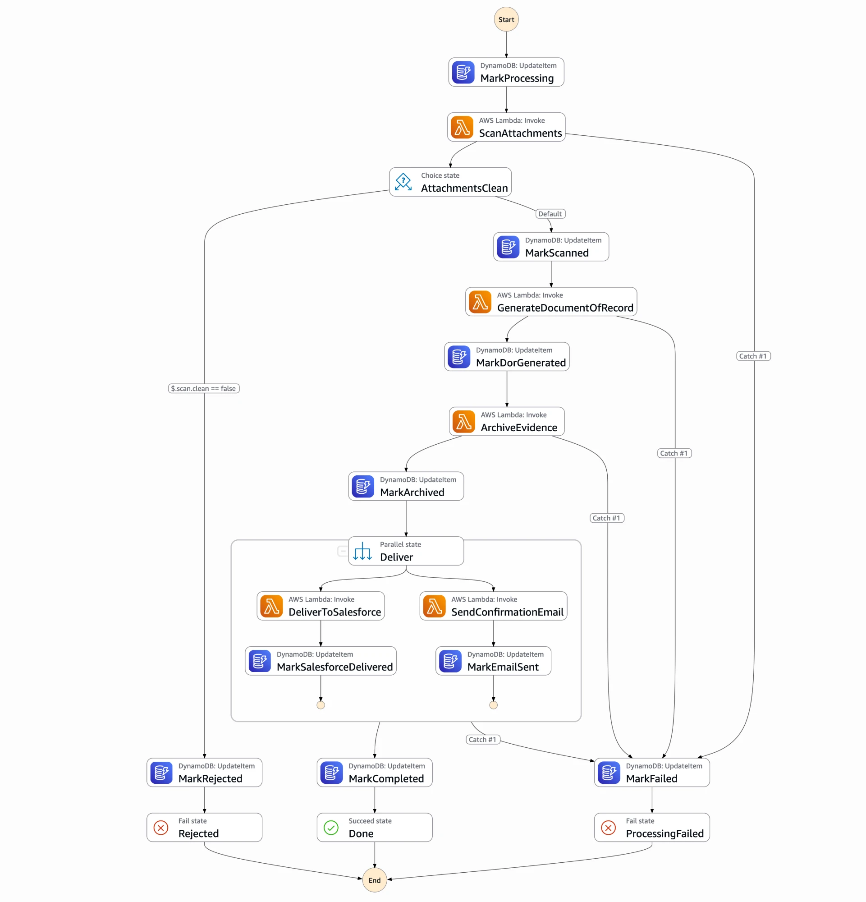

# Forms Prototype

A learning prototype of the AWS core of a forms platform: a form UI that
submits to API Gateway + Lambda, with direct-to-S3 attachment uploads and an
asynchronous Step Functions workflow that scans, archives and delivers each
submission to Salesforce (mocked) and a confirmation email (Amazon SES).

AEM, CloudFront/WAF, analytics and Adobe cloud services are intentionally out
of scope; Adobe Document Services, GuardDuty malware scanning, and Salesforce are
replaced by mocks.

## Architecture

```
Browser (web/)                          AWS (infra/, one CDK stack)
  GET  /config       ─────────────────► ConfigFn      form definition + dropdowns
  POST /uploads      ─────────────────► UploadUrlFn   presigned S3 POST
  POST <S3>          ─────────────────► Attachments bucket
  POST /submit       ─────────────────► SubmitFn      validate, store, start workflow
  GET  /status/{id}  ─────────────────► StatusFn      poll processing status
                                              │
                                              ▼
                          Step Functions: SubmissionWorkflow
                          scan attachments ─► generate document of record
                          ─► archive evidence ─► deliver in parallel
                             (Salesforce, email, with retries) ─► completed
                                    │ HTTP                │
                                    ▼                     ▼
             Mock Salesforce API (separate API Gateway)   Amazon SES
```

### Submission workflow

The state machine as shown in the Step Functions console. Every Lambda step
has a Catch that routes to `MarkFailed`; the delivery steps first retry
temporary errors with exponential backoff.



### Project layout

| Path | Contents |
|---|---|
| `infra/` | CDK app: `forms-stack.ts` (all resources), `submission-workflow.ts` (state machine) |
| `lambdas/` | API handlers |
| `lambdas/workflow/` | Workflow steps and integration adapters |
| `lambdas/mocks/` | Mock Salesforce |
| `lambdas/shared/` | Form definition and validation, DynamoDB and HTTP helpers |
| `web/` | Plain HTML/JS form, no build step |

## Prerequisites

- Node.js 22+ (20 works for now, with an AWS SDK deprecation warning)
- AWS CLI v2, signed in to an account (`aws login` or `aws sso login`)
- One-time per account and region: `npx cdk bootstrap`
- An email address to send confirmation emails from (see below)

## Usage

```bash
npm install
npm run deploy -- -c senderEmail=you@example.com
                   # deploys to eu-central-1, writes web/cdk-outputs.json
npm run web        # serves the form on http://localhost:8080
npm run destroy    # removes everything, including stored data
```

Every CDK command (`deploy`, `destroy`, `synth`, `diff`) needs the sender
address. To avoid passing `-c senderEmail=...` each time, put it in
`cdk.json`: `"context": { "senderEmail": "you@example.com" }`.

### Confirmation emails (Amazon SES)

The first deploy creates an SES identity for the sender address, and SES
emails it a verification link: click it, or sending fails. New AWS accounts
are in the SES sandbox, where every *recipient* must be verified too: add the
address you enter in the form under SES → Identities (or request production
access). An unverified recipient fails the email step without retries, and
the submission ends up FAILED.

`npm run typecheck` checks the TypeScript; `npx cdk diff` shows what a deploy
would change, including IAM changes.

## Testing failure paths

| Input | Result |
|---|---|
| `#fail-salesforce` in the message | Salesforce always returns 503; retries exhausted, status FAILED |
| `#flaky-salesforce` in the message | Salesforce fails twice, succeeds on the third attempt |
| Attachment name containing `eicar` | Simulated malware, submission rejected |
| Non-PDF file renamed to `.pdf` | Content doesn't match type, submission rejected |

Besides these, the Salesforce mock fails at random at the rate set by
`FAILURE_RATE` in `infra/forms-stack.ts`.

## Prototype shortcuts

Not production-ready by design: CORS allows any origin, APIs have no auth or
WAF, buckets and the table are deleted with the stack, and the evidence
bucket has no Object Lock.
